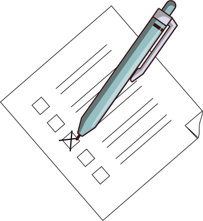
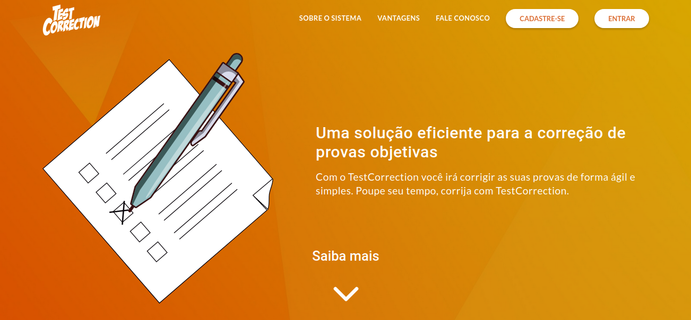

  

<h1 align="center">Test Correction</h1>

<h2 align="center">
  A simple and dynamic system for the correction of objective tests 🗒️
</h2>

 

  
  
  

 

  

 

  <a href="#goal">Goal</a> •
  <a href="#features">Features</a> •
  <a href="#technologies">Technologies</a> •
  <a href="#author">Author</a>

 

<h2 id="goal">🎯️ Goal</h2>

 

  The goal of Test Correction is to enable the creation and correction of objective tests in an efficient and simplified way.

 

<h2 id="features">💻️ Features</h2>

 

- [ ] User registration
- [ ] User authentication
- [ ] Classes registration
- [ ] Students registration
- [ ] Tests creation
- [ ] Tests correction
- [ ] Reports
- [ ] Statistics
- [ ] Notifications

 

<h2 id="technologies">🛠 Technologies</h2>

 

The following tools were used in the development of the project:

- [React](https://pt-br.reactjs.org/)
- [Axios](https://github.com/axios/axios)
- [Redux](https://redux.js.org/)
- [Redux Saga](https://redux-saga.js.org/)
- [Immer](https://github.com/immerjs/immer)
- [React Lazy Load](https://www.npmjs.com/package/react-lazy-load)

 

<h2 id="author">✏️️ Author</h2>

 

<a>
  
   
  <strong>Lucas Santos</strong>
</a>

 

Get in touch!

<h4 align="center">
🚧  Test Correction 🗒️ In development...  🚧
</h4>
